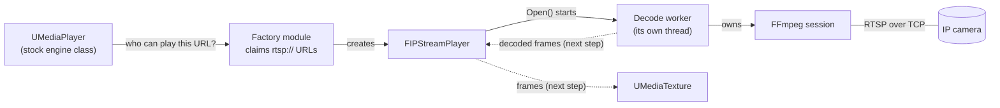

# IPStreamMedia

**Live RTSP camera feeds in Unreal Engine 5.3, played through the engine's own Media Framework.**

IPStreamMedia is a media player plugin for Unreal Engine. It registers with the
Media Framework the same way the engine's built-in players do, so a stock Media
Player, Media Texture and the usual Blueprint nodes work on an `rtsp://` URL,
with no custom API to learn. FFmpeg handles the network and the decoding, on a
thread of its own.

Unreal's Media Framework has no player built for live camera streams: Electra
covers HLS, DASH and video files. This plugin fills that gap for RTSP. The
target demo is a game scene: a real camera feed on an in-game surveillance
monitor.

> [!NOTE]
> **Work in progress.** The player registers, connects and decodes on its own
> thread, but frames don't reach a texture yet. That is the next step.

## Status

| Milestone | Goal | State |
|---|---|---|
| M0 | The camera's stream decodes outside Unreal (`ffprobe`, `ffplay`) | Done |
| M1 | FFmpeg works inside Unreal: one frame on a plane, as a throwaway test | Done |
| M2 | A real Media Framework player, with live video in a `UMediaTexture` | **In progress.** Registered, selectable, and decoding on its own thread with automatic reconnect. Next: frames into the texture. |
| M3 | Colour conversion on the GPU instead of the CPU | Planned. Optional: the CPU path ships if time runs out. |
| M4 | Survives pulled cables, bad URLs, stopping Play mid-stream, and 50 open/close cycles | Planned |
| M5 | A measured latency figure, and a packaged Windows build that streams | Planned |
| M6 | Demo: a live feed on an in-game surveillance monitor | Planned |

`IPStreamSpike.h`/`.cpp` is M1's throwaway test. It blocks the game thread on
purpose and is not how the player works. It gets deleted once M2 shows a
picture.

## How it works



- **Two modules, split the way Unreal's own media plugins are.**
  `IPStreamMediaFactory` is small: it tells the Media Framework which URLs it
  handles, and creates the player on request. The editor can query it even
  where the player itself can't load. `IPStreamMedia` holds the player and
  everything that touches FFmpeg.
- **FFmpeg is its own External module.** Its DLLs ship inside the plugin folder
  and are loaded at startup, so nothing is installed system-wide. If a DLL
  fails to load, the plugin logs it and refuses to create players, instead of
  crashing later.
- **`Open()` returns straight away.** A decode thread connects, reads and
  decodes. If a working stream drops, the thread waits 1 s and reconnects by
  itself, doubling the wait after each failed attempt, up to 8 s.
- **`Close()` stops that thread and waits for it to finish.** A thread blocked
  on the network can't look at a stop flag, so FFmpeg's interrupt callback
  looks at it instead. That keeps `Close()` fast (numbers below).

**Where to look in the code:**

| File | Job |
|---|---|
| [`IPStreamMediaFactoryModule.cpp`](Plugins/IPStreamMedia/Source/IPStreamMediaFactory/Private/IPStreamMediaFactoryModule.cpp) | Registers with the Media Framework and claims `rtsp` |
| [`IPStreamPlayer.cpp`](Plugins/IPStreamMedia/Source/IPStreamMedia/Private/IPStreamPlayer.cpp) | The `IMediaPlayer` the engine talks to |
| [`IPStreamDecodeWorker.cpp`](Plugins/IPStreamMedia/Source/IPStreamMedia/Private/IPStreamDecodeWorker.cpp) | The decode thread: connect, decode, reconnect with backoff, shut down |
| [`IPStreamFFmpegSession.cpp`](Plugins/IPStreamMedia/Source/IPStreamMedia/Private/IPStreamFFmpegSession.cpp) | One FFmpeg connection: open, decode the next frame, close |
| [`IPStreamMediaModule.cpp`](Plugins/IPStreamMedia/Source/IPStreamMedia/Private/IPStreamMediaModule.cpp) | Loads the FFmpeg DLLs at startup |
| [`FFmpeg.Build.cs`](Plugins/IPStreamMedia/Source/ThirdParty/FFmpeg/FFmpeg.Build.cs) | Build rules that link and package FFmpeg |

## Numbers so far

M1's test fetched one frame on the game thread, so the game froze while it
waited. The player now does that work on its decode thread.

| | M1 test (game thread) | Now (decode thread) |
|---|---|---|
| Opening a stream | Game froze for 0.999 s | Game keeps running: 189 frames rendered during one 1.6 s connect |
| Unreachable URL | Game froze for 6.039 s, until the timeout | Game keeps running while the decode thread retries |
| Closing a stream | Nothing left running to stop | 37 ms median while streaming, 65 ms while connecting, 1.5 ms between reconnect attempts. Worst seen: 92.8 ms |

- **How closing was measured:** the time `Close()` spends waiting for the decode
  thread, taken with `FPlatformTime::Seconds()` and cross-checked against the
  gap between game-thread ticks. 10 to 13 runs per case.
- **Why the ceiling is about 100 ms:** while FFmpeg is blocked on the network,
  it checks for our stop request every 100 ms (`POLLING_TIME` in FFmpeg's
  `libavformat/network.h`). While streaming, the decode loop also checks
  between packets, which is why that case is faster. Between reconnect
  attempts the thread waits in our own code, and a stop wakes it at once.
- **Latency is not measured yet.** That comes at M5, with a glass-to-glass
  method (the camera filming a stopwatch on a screen), described in
  [Architecture §11](Docs/Architecture.md#11-latency-measurement-method). The
  1.6 s above is how long one connection took to deliver its first frame,
  which is a different thing.

## Design decisions

The full log, with the alternative that lost each time and what would reopen
it, is in [Architecture §12](Docs/Architecture.md#12-decision-log).

- **A real Media Framework player, not a custom API.** Stock engine classes and
  Blueprint nodes are used unchanged. The engine integration is the point.
- **`Close()` waits for the decode thread, instead of leaving it to finish in
  the background.** Unreal's Electra player hands its teardown to a background
  task and returns at once. That would be unsafe here: this plugin unloads the
  FFmpeg DLLs itself, and a thread still running inside them at that moment
  would crash. Waiting is safe because it is short and bounded.
- **Reconnecting is the player's job, not the game's.** A dropped stream comes
  back without Blueprint doing anything. How many attempts to make before
  giving up is set per media source
  ([Architecture §8](Docs/Architecture.md#8-connection-lifecycle)).
- **FFmpeg under the LGPL, dynamically linked, never GPL.** That keeps the
  plugin's own code MIT (see [Licensing](#licensing)).
- **FFmpeg's binaries are committed through Git LFS, not downloaded by a
  script.** Clone and build, with nothing else to fetch.

## Building it

**Requirements:** Unreal Engine 5.3, Windows 64-bit, Visual Studio 2022 with
the "Game development with C++" workload, and [Git LFS](https://git-lfs.com).

1. Run `git lfs install` **before** cloning. The FFmpeg DLLs and import
   libraries live in LFS; without it they arrive as small placeholder files,
   and the plugin fails to build. (Already cloned? Run `git lfs pull`.)
2. Clone the repository.
3. Right-click `IPStreamMediaDemo.uproject` and choose **Generate Visual Studio
   project files**.
4. Open `IPStreamMediaDemo.sln`, build **Development Editor | Win64**, and start
   the editor.

On startup, the Output Log should show:

```
LogIPStreamMedia: IPStreamMedia module has started. ^_^
LogIPStreamMediaFactory: Display: IPStreamMedia player factory registered
```

## Trying it today

There is no picture yet, but you can watch the player connect and decode.

1. In the Content Browser, create a **Media → Stream Media Source**, and set its
   **Stream Url** to your camera's `rtsp://` address.
2. In the same asset, under **Platforms → Player Overrides**, set **Windows** to
   **IP Stream Media**. WmfMedia, which ships with the engine, also claims
   `rtsp` URLs; without the override, whichever player registered first gets
   the stream.
3. Create a **Media → Media Player** asset. In a Blueprint, call **Open Source**
   on it with your media source.
4. Press Play. The Output Log shows the connection, a first-frame message, then
   progress every 250 frames:

```
LogIPStreamMedia: Display: Player opened rtsp://***@camera-host:554/stream
LogIPStreamMedia: Display: DecodeWorker: DecodeStream(): First frame decoded on this connection (1 frames decoded so far). ^_^
```

The plugin removes credentials from any URL it logs.

**Limiting reconnect attempts.** Before **Open Source**, call
**SetMediaOption (integer64)** on the media source, with the key
`MaxReconnectAttempts`:

| Value | Behaviour |
|---|---|
| `0` (default) | Retry forever |
| *N* | Give up after *N* failed connection attempts in a row. For now this is a log warning; reporting it to Blueprint comes with M4. |

It must be the **integer64** node. The player reads an integer64, and a value
set with any other type is silently ignored, which means retry forever. Options
set this way are not saved in the asset.

> [!WARNING]
> **A Stream Media Source saves its URL inside the `.uasset` file, password
> included.** Git shows a `.uasset` change only as binary, so a committed
> password is easy to miss. Clear the URL before committing the asset.

## Scope and known issues

**Phase 1 scope:** RTSP only, Windows 64-bit only, one stream at a time, video
only (no audio). Tested against one camera: HEVC, 1280×720, 25 fps. SRT and
RTMP are planned as later phases. The full list of what Phase 1 will not do is
in [Architecture §2](Docs/Architecture.md#2-phase-1-target-and-non-goals).

**Known issues right now:**

- `MediaOpened` fires as soon as `Open()` returns, before the connection is
  made, and connection failures are not reported to Blueprint yet. Both are M4
  work.
- Closing a stream while it is still connecting can log an error
  (`avformat_open_input() failed`). It is our own stop request, not a real
  failure.
- Editing a Stream Media Source's URL makes the editor open the stream in the
  background, to draw its Content Browser thumbnail. Until frames reach a
  texture, that connection stays open until you next press Play or close the
  editor.

## Licensing

- **This repository's own code** is MIT: see [`LICENSE.md`](LICENSE.md). That
  licence covers this repository's own code only. Third-party components carry
  their own licences.
- **FFmpeg** is used under the **LGPL v3**: a pinned build
  (`N-126455-gecc7eb519e`, BtbN's `win64-lgpl-shared`), with its DLLs shipped
  unmodified and linked dynamically. The licence text and the exact build
  details are in
  [`COPYING.LGPLv3`](Plugins/IPStreamMedia/ThirdParty/FFmpeg/COPYING.LGPLv3) and
  [`NOTICE.md`](Plugins/IPStreamMedia/ThirdParty/FFmpeg/NOTICE.md).
- **Using your own FFmpeg build**, which the LGPL entitles you to: replace the
  files in `Plugins/IPStreamMedia/ThirdParty/FFmpeg/`, then regenerate the MSVC
  import libraries as `NOTICE.md` describes. If your build's DLL version
  numbers differ, update the DLL names in `FFmpeg.Build.cs` and
  `IPStreamMediaModule.cpp`.
- **Other libraries inside the FFmpeg DLLs.** The pinned build compiles about
  forty other open-source libraries into its DLLs (listed in `NOTICE.md`'s
  configure line). Their individual licences have not been audited yet.
- **Codec patents.** HEVC (H.265) is covered by patents, which FFmpeg's licence
  does not address. Patent licensing for any product that ships this plugin is
  the integrator's responsibility.

## About

Built by Sanjyot Dahale as a learning project, with Claude (Anthropic's AI
model) as a tutor. The code is explained one piece at a time, then typed in by
hand, and each design decision is reasoned out from the engine's own source,
with the alternative that lost written down.

Development is written up as a devlog, starting with
[IPStreamMedia #1](https://sanjyotdahale.dev/devlogs/2026/08/23/ipstream_1.html).

More detail: [architecture and decision log](Docs/Architecture.md) ·
[glossary](Docs/Glossary.md) · [test camera measurements](Docs/TestSource.md)
